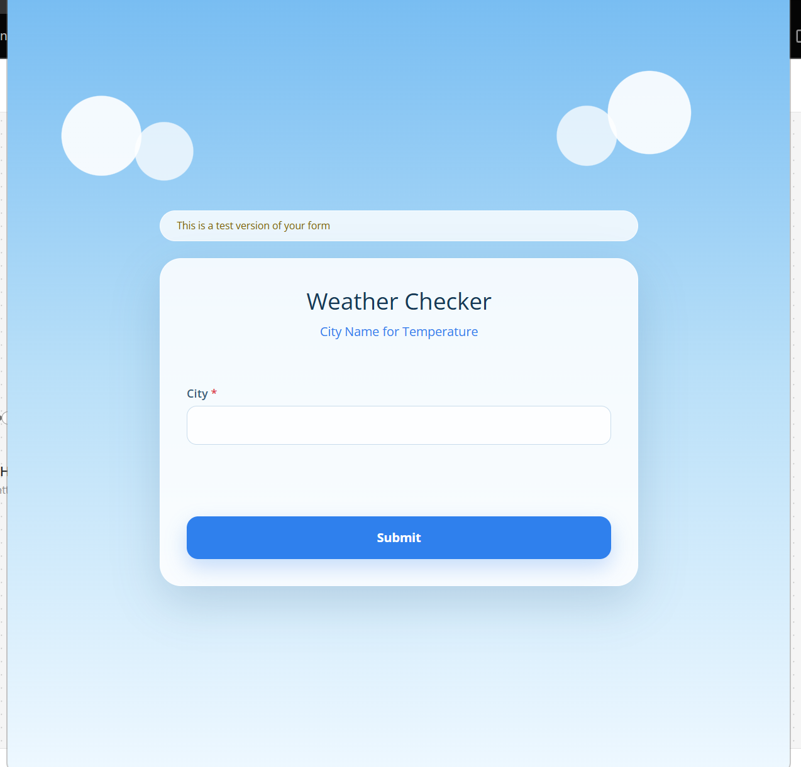
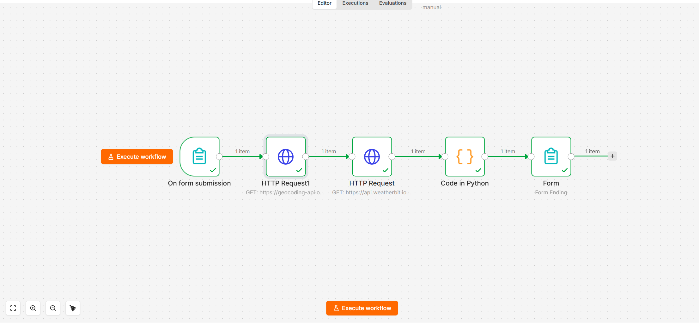
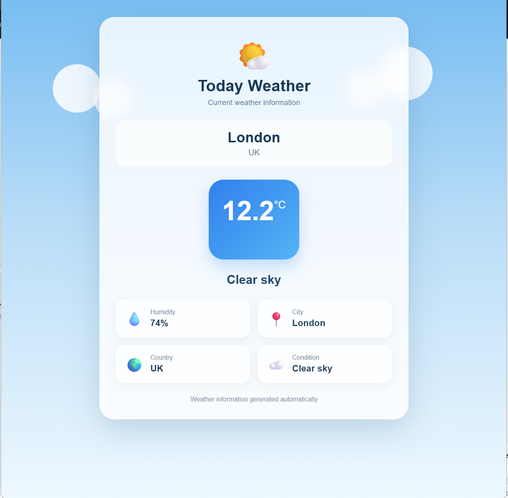

# 🌤️ n8n Interactive Weather App

An interactive, automated weather dashboard built entirely within **n8n**. This workflow takes a city name as input via a web form, dynamically fetches its geographical coordinates, retrieves real-time weather data, processes it using native Python, and displays a beautiful, mobile-friendly UI as the final output.

## 🚀 Features
* **Dynamic Geocoding:** Uses the Open-Meteo API to automatically convert any city name into precise Latitude and Longitude globally (No hardcoded country codes).
* **Real-Time Weather Data:** Integrates with the Weatherbit API to fetch accurate, up-to-the-minute weather conditions.
* **Native Python Processing:** Uses n8n's Code Node (Python) to cleanly parse and structure API JSON responses without relying on external local scripts.
* **Custom UI/UX:** Utilizes custom HTML & CSS in the n8n Form Ending node to generate a stunning, intuitive weather dashboard directly in the user's browser.

## 📸 User Journey & Workflow

### 1. The Input Form
The user is prompted to enter any city name worldwide.

### 2. The n8n Workflow Architecture
The backend process that orchestrates APIs, handles Python logic, and serves the UI.

### 3. The Final Dashboard
The beautifully rendered output displaying temperature, humidity, and location details.

## 🛠️ Tech Stack
* **Automation Engine:** n8n (Self-hosted / Docker)
* **Programming:** Python (n8n Code Node)
* **Frontend:** HTML3 & Custom CSS
* **APIs Used:** 
  * Open-Meteo Geocoding API
  * Weatherbit v2.0 API

## ⚙️ How to Use This Workflow
1. Download the `n8n-Interactive-Weather-App.json` file from this repository.
2. Open your n8n instance, go to your workflows, and click **Import from File**.
3. Double-click the `HTTP Request` node (Weatherbit API).
4. Replace `"Add Your Api Key"` with your actual Weatherbit API Key.
5. Click **Execute Workflow** and open the Test URL to check the weather anywhere in the world!

---
**Developed by [Hafiz Abu Bakar Siddique](https://github.com/hafizabubakar-dev)**  
*Automation Workflow Developer | n8n & Python*
